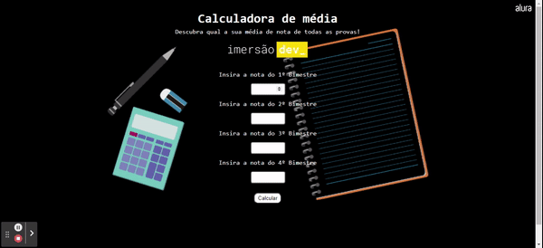

<h1 align="center" font-size="bold" color-font="red"> TrailerFlix </h1>

# Calculadora de média

  

# Resumo do projeto

  
  ``Projeto criado na imersão_dev da Alura!``
  
  ``Com essa calculadora é possivel entrar com as notas dos 4 bimestres e receber o calculo da nota final. Conforme a nota final ele te apresenta uma mensagem de aprovado ou reprovado.``

## 🔨 Funcionalidades do projeto

- `Funcionalidade 1` `Bimestres`: Caixas de entrada de texto para cada um dos 4 bimestres.
- `Funcionalidade 2` `Calcular`: Botão calcular, com calculo automatico da média.
- `Funcionalidade 3` `Nota final`: Mensagem com a nota média final.
- `Funcionalidade 4` `Aprovado ou reprovado`: Mensagem avisando caso o aluno tenha sido aprovado ou reprovado.

## ✔️ Tecnologias utilizadas

- ``JavaScript``
- ``HTML5``
- ``CSS3``
- ``VS code``

## 💻 Acesse o site

https://calculadora-de-m-dia.vercel.app/
